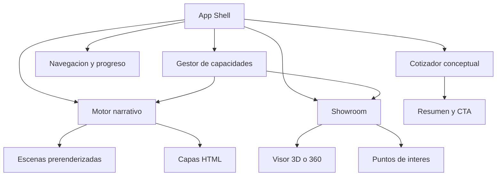

# Especificacion Maestra: Demo Inmersiva Premium Tropical para Cootrasec

**Fecha:** 2026-06-13  
**Estado:** Diseno aprobado, listo para planificacion tecnica  
**Tipo de proyecto:** Prototipo comercial interactivo  
**Objetivo principal:** Impresionar al cliente, demostrar capacidad creativa y vender el desarrollo del sitio web definitivo  

## 1. Resumen ejecutivo

Se construira una landing page conceptual, cinematografica e interactiva para presentar a Cootrasec una vision avanzada de su futura presencia digital. La demo no pretende ser el sitio definitivo, representar con exactitud toda la flota ni integrar procesos operativos reales. Su funcion es volver tangible una propuesta ambiciosa y provocar una decision comercial favorable.

La experiencia presentara una flota conceptual compuesta por camioneta ejecutiva, van corporativa y bus premium, dentro de un recorrido visual inspirado en Cordoba, Colombia. El visitante avanzara mediante desplazamiento natural por una narrativa continua que culminara en un showroom interactivo del bus y una simulacion de cotizacion empresarial.

La solucion sera deliberadamente hibrida:

- Las escenas narrativas y transformaciones utilizaran recursos prerenderizados de alta fidelidad.
- El showroom final utilizara 3D interactivo real o una simulacion 360 de alta calidad, segun lo que validen los spikes tecnicos.
- La interfaz, textos, controles y cotizador se implementaran en HTML accesible sobre las escenas visuales.
- La experiencia adaptara su calidad segun el dispositivo, el rendimiento disponible y la preferencia de movimiento del usuario.

## 2. Contexto y oportunidad

Cootrasec es la Cooperativa de Transporte Especial de Cordoba. Su propuesta comercial combina trayectoria, seguridad, transporte especial, capacidad empresarial y una flota diversa. Su presencia digital actual se concentra principalmente en redes sociales y directorios, por lo que una experiencia web diferenciada puede posicionarla como una empresa regional moderna, confiable y tecnologicamente avanzada.

El proyecto parte de una ventaja importante: al tratarse de una demo comercial, existe libertad para utilizar vehiculos conceptuales, caracteristicas simuladas, cifras ilustrativas y recursos generados. Esto permite concentrar la inversion inicial en impacto visual y claridad narrativa, sin depender de fotografiar o modelar la flota real antes de vender la idea.

## 3. Objetivos

### 3.1 Objetivo comercial principal

Lograr que el cliente comprenda y desee una experiencia web inmersiva para Cootrasec.

La reaccion esperada al finalizar la presentacion es:

> Quiero que mi empresa tenga una pagina como esta.

### 3.2 Objetivos secundarios

- Demostrar capacidad de direccion creativa, diseno y desarrollo avanzado.
- Diferenciar la propuesta frente a una landing corporativa convencional.
- Mostrar como una web puede convertir la flota en una experiencia de venta.
- Hacer visible el potencial de futuras funciones como catalogo, showroom, GPS y cotizacion.
- Producir una demo reutilizable como pieza de portafolio y base de negociacion.

### 3.3 Objetivos que no pertenecen a esta fase

- Representar fielmente todos los vehiculos reales de Cootrasec.
- Calcular precios reales.
- Consultar disponibilidad real.
- Integrar GPS real.
- Implementar administracion de flota.
- Crear un backend empresarial completo.
- Construir recorridos 3D detallados para cada vehiculo.

## 4. Criterios de exito

La demo se considerara exitosa cuando:

1. La propuesta de valor se entienda durante los primeros 15 segundos.
2. El recorrido completo pueda presentarse en aproximadamente 2 a 4 minutos.
3. La transicion camioneta, van y bus produzca un momento visual memorable.
4. El showroom del bus responda con fluidez en el computador de presentacion.
5. El cotizador simulado comunique claramente el potencial comercial.
6. La experiencia pueda recorrerse sin instrucciones tecnicas.
7. Exista una alternativa funcional para movil y movimiento reducido.
8. La carga inicial muestre contenido significativo rapidamente.
9. No existan bloqueos, saltos bruscos ni secuestro incomodo del desplazamiento.
10. El cliente pueda distinguir entre la demo actual y las posibilidades del producto final.

## 5. Audiencia de la demo

### 5.1 Audiencia primaria

Directivos, responsables comerciales y tomadores de decisiones de Cootrasec.

### 5.2 Audiencia secundaria

Responsables de contratacion empresarial que eventualmente utilizarian el sitio definitivo.

### 5.3 Necesidades emocionales

- Sentir que Cootrasec puede proyectarse como una marca premium.
- Reconocer su identidad regional sin percibirla como tradicional o anticuada.
- Entender que la tecnologia puede fortalecer la confianza y las ventas.
- Visualizar posibilidades sin necesitar conocimientos tecnicos.

## 6. Concepto creativo

### 6.1 Nombre conceptual

**El viaje que su empresa merece**

### 6.2 Idea central

Un viaje continuo a traves de un paisaje inspirado en Cordoba presenta como Cootrasec puede acompañar diferentes escalas de movimiento empresarial. La experiencia comienza con una camioneta, evoluciona hacia una van y culmina con un bus premium.

El paisaje no funcionara como postal turistica. Sera una expresion contemporanea del territorio: luz calida, vegetacion profunda, agua, carreteras abiertas, texturas naturales y arquitectura discreta.

### 6.3 Direccion visual aprobada: Premium Tropical

La estetica combinara:

- Lujo contemporaneo.
- Calidez tropical.
- Paisajes inspirados en Cordoba y el rio Sinu.
- Tecnologia presentada con discrecion.
- Sensacion de calma, precision, amplitud y confianza.

Se evitaran:

- Folclor literal.
- Saturacion de elementos tropicales.
- Interfaces futuristas genericas.
- Exceso de neones, particulas o efectos decorativos.
- Apariencia de concesionario europeo sin identidad regional.

### 6.4 Paleta inicial

| Rol | Color |
|---|---|
| Verde selva profundo | `#15382D` |
| Marfil calido | `#F4F0E6` |
| Dorado solar | `#D8A84E` |
| Grafito | `#181C1B` |
| Verde de accion | `#70A67C` |

La paleta se validara durante la fase de concepto visual. Estos valores son una direccion, no una obligacion inmutable.

## 7. Estrategia de experiencia

### 7.1 Principio rector

La animacion debe contar y vender. Ningun efecto existira unicamente para demostrar complejidad tecnica.

### 7.2 Arquitectura narrativa

```text
Impacto inicial
    -> Confianza y tecnologia
    -> Escala de la flota
    -> Gran revelacion del bus
    -> Exploracion interactiva
    -> Cotizacion conceptual
    -> Cierre comercial
```

### 7.3 Duracion esperada

- Recorrido guiado durante presentacion: 2 a 4 minutos.
- Exploracion libre del showroom: sin limite.
- Cotizacion conceptual: menos de 45 segundos.

### 7.4 Modelo de desplazamiento

El desplazamiento controlara el progreso narrativo, pero conservara comportamiento natural.

Reglas:

- No bloquear permanentemente el scroll.
- Usar secciones fijadas solo durante momentos breves y comprensibles.
- Permitir saltar directamente a `Flota`, `Experiencia`, `Seguridad` y `Cotizar`.
- Mantener visibles las pistas de avance cuando una escena este fijada.
- Evitar que movimientos minimos del usuario produzcan desplazamientos visuales violentos.
- Proporcionar una version de movimiento reducido.

## 8. Guion detallado por escenas

### Escena 0. Precarga expresiva

**Proposito:** evitar una espera vacia y preparar el tono.

**Visual:** reflejo solar moviendose sobre una superficie oscura que gradualmente revela la silueta de un vehiculo.  
**Texto:** `Preparando el recorrido`.  
**Comportamiento:** mostrar progreso real de recursos esenciales. No esperar la descarga de todo el sitio para entrar.

### Escena 1. Amanecer y propuesta de valor

**Proposito comercial:** explicar inmediatamente que se trata de transporte empresarial premium.

**Visual:** carretera tropical al amanecer; una camioneta ejecutiva se acerca y entra en composicion.  
**Titular:** `El viaje que su empresa merece.`  
**Apoyo:** `Transporte especial pensado para mover personas, equipos y grandes decisiones.`  
**Acciones:** `Explorar experiencia` y `Cotizar servicio`.

**Interaccion:** el primer desplazamiento hace avanzar la camioneta y modifica gradualmente la luz.

### Escena 2. Confianza en movimiento

**Proposito comercial:** convertir seguridad y operacion en atributos premium.

**Visual:** camara lateral acompanando la camioneta. Elementos de interfaz discretos aparecen junto al recorrido.  
**Mensajes conceptuales:** puntualidad, monitoreo, conductores capacitados y planeacion.

**Regla:** los datos deben sentirse integrados al viaje, no como un tablero tecnologico invasivo.

### Escena 3. Transformacion de la flota

**Proposito comercial:** demostrar que existe una solucion para cada escala.

**Visual:** la camioneta atraviesa una zona de luz y se transforma fluidamente en van ejecutiva. Posteriormente, la van conduce hacia la gran revelacion del bus.

**Titular:** `Una solucion para cada equipo, evento y recorrido.`

**Tecnica preferida:** secuencia prerenderizada controlada por scroll.  
**Alternativa:** video corto sincronizado o transicion por capas si la secuencia no cumple el presupuesto de carga.

### Escena 4. Van corporativa

**Proposito comercial:** mostrar comodidad y adecuacion empresarial.

**Visual:** exterior de la van y una revelacion breve del interior.  
**Caracteristicas conceptuales:** conectividad, climatizacion, espacio de equipaje y comodidad ejecutiva.

**Interaccion:** puntos ligeros o tarjetas contextuales vinculadas al progreso.

### Escena 5. Gran revelacion del bus

**Proposito comercial:** crear el momento mas memorable.

**Visual:** el paisaje se abre junto a un cuerpo de agua inspirado en el rio Sinu. Aparece el bus premium en una composicion amplia y luminosa.

**Titular:** `Cuando todos deben llegar bien, cada detalle importa.`

**Transicion:** la narrativa prerenderizada entrega el control al showroom interactivo sin un corte visual evidente.

### Escena 6. Showroom interactivo

**Proposito comercial:** demostrar capacidad tecnologica real.

**Funciones prioritarias:**

- Rotar el bus.
- Acercar y alejar dentro de limites controlados.
- Seleccionar puntos de interes.
- Cambiar entre exterior e interior conceptual.
- Activar una variacion de iluminacion.
- Iniciar cotizacion con el bus seleccionado.

**Puntos de interes sugeridos:**

- Capacidad.
- Sillas reclinables.
- Climatizacion.
- Entretenimiento.
- Equipaje.
- Monitoreo y seguridad.

### Escena 7. Interior conceptual

**Proposito comercial:** vender la experiencia del pasajero.

**Opcion preferida:** panorama 360 o escena prerenderizada navegable.  
**Opcion avanzada:** interior 3D ligero si el spike demuestra suficiente calidad y rendimiento.

**Regla:** no construir un recorrido libre estilo videojuego. El usuario necesita comprender el interior, no aprender controles de navegacion.

### Escena 8. Cotizador demostrativo

**Proposito comercial:** conectar la emocion con una accion de negocio.

**Campos visibles:**

- Tipo de servicio.
- Numero de pasajeros.
- Origen.
- Destino.
- Fecha aproximada.
- Vehiculo seleccionado.

**Resultado simulado:**

- Resumen del servicio.
- Vehiculo recomendado.
- Mensaje de disponibilidad ilustrativo.
- Accion `Solicitar propuesta`.

No se mostrara un precio inventado como si fuera definitivo. La salida comunicara que un asesor preparara una propuesta.

### Escena 9. Cierre

**Proposito comercial:** cerrar con escala, identidad y accion.

**Visual:** camioneta, van y bus avanzan juntos hacia el horizonte.  
**Mensaje:** `Cordoba se mueve con nosotros.`  
**Acciones:** `Solicitar cotizacion` y `Conocer la propuesta digital`.

## 9. Comparacion de enfoques y decision

### 9.1 Alternativa descartada: landing completamente 3D

Ventajas:

- Maxima libertad de camara.
- Interaccion continua.
- Alta demostracion tecnica.

Razones para no seleccionarla:

- Riesgo alto de rendimiento.
- Produccion y optimizacion complejas.
- Calidad visual dependiente de modelos y materiales excelentes.
- Mayor probabilidad de fallar durante una presentacion comercial.
- El 3D constante puede competir con el mensaje.

### 9.2 Alternativa descartada: video lineal

Ventajas:

- Calidad cinematografica.
- Reproduccion predecible.
- Produccion tecnica sencilla.

Razones para no seleccionarla:

- Poca interaccion.
- Se percibe como pieza audiovisual, no como experiencia web avanzada.
- Comunica peor el potencial del showroom y cotizador.

### 9.3 Alternativa aprobada: experiencia hibrida cinematografica

Combina:

- Secuencias prerenderizadas para escenas narrativas.
- HTML para mensajes, navegacion y conversion.
- 3D real o 360 interactivo para el bus.
- Degradacion progresiva para dispositivos limitados.

Esta opcion maximiza impacto y mantiene el riesgo bajo control.

## 10. Arquitectura funcional



### 10.1 App Shell

Responsabilidades:

- Estructura global.
- Navegacion.
- Estado de carga.
- Transiciones entre narrativa, showroom y cotizador.
- Manejo de errores visibles.

No debe contener logica detallada de animacion o 3D.

### 10.2 Gestor de capacidades

Responsabilidades:

- Detectar tamano de pantalla.
- Detectar preferencia de movimiento reducido.
- Evaluar soporte WebGL.
- Seleccionar nivel de calidad inicial.
- Permitir reducir calidad si el rendimiento cae.

Salida conceptual:

```ts
type ExperienceTier = "high" | "balanced" | "lite" | "reduced-motion";
```

### 10.3 Motor narrativo

Responsabilidades:

- Asociar progreso de scroll con escenas.
- Activar textos y capas.
- Sincronizar secuencias visuales.
- Entregar control al showroom.
- Limpiar correctamente animaciones al cambiar de variante.

Cada escena debe ser independiente y registrar sus recursos, duracion y comportamiento.

### 10.4 Showroom

Responsabilidades:

- Cargar el recurso interactivo solo cuando sea necesario.
- Gestionar camara y rotacion.
- Gestionar puntos de interes.
- Comunicar el vehiculo seleccionado al cotizador.
- Detener el renderizado cuando no exista movimiento.

### 10.5 Cotizador conceptual

Responsabilidades:

- Recoger datos minimos.
- Recomendar un vehiculo mediante reglas locales simples.
- Mostrar un resumen convincente.
- Simular el envio sin backend real.

### 10.6 Datos de contenido

Los textos, vehiculos y caracteristicas se modelaran como datos separados de los componentes visuales. Esto permitira sustituir contenido conceptual por informacion real si se aprueba el proyecto definitivo.

## 11. Flujo de datos

```text
Capacidades del dispositivo
    -> seleccion de tier
    -> carga de recursos apropiados
    -> progreso narrativo
    -> seleccion de vehiculo
    -> cotizador precargado
    -> resumen conceptual
```

El estado global sera pequeno y explicito:

- Nivel de experiencia.
- Escena activa.
- Progreso general.
- Vehiculo seleccionado.
- Punto de interes activo.
- Estado del cotizador.
- Estado de carga o error.

Los valores de animacion de alta frecuencia no deben almacenarse en estado React.

## 12. Estrategia tecnica recomendada

### 12.1 Base de aplicacion

Para la demo se recomienda **React + Vite + TypeScript**.

Motivos:

- La carpeta inicial esta vacia.
- No se necesita SEO real ni renderizado de servidor para vender la demo.
- Vite ofrece un entorno directo para experiencias visuales.
- Reduce complejidad frente a Next.js durante los spikes y la presentacion.

Si posteriormente se aprueba el producto definitivo, se evaluara migrar o reconstruir con Next.js.

### 12.2 Animacion narrativa

- GSAP.
- ScrollTrigger.
- `@gsap/react`.
- Scroll nativo como base.

No se incorporara inicialmente una libreria adicional de smooth scrolling. Solo se evaluara si los spikes demuestran una mejora clara sin degradar rendimiento ni accesibilidad.

### 12.3 Visualizacion interactiva

Opcion inicial:

- React Three Fiber.
- Drei para controles y utilidades puntuales.
- Three.js como base.

React Three Fiber se mantendra solo si permite alcanzar el objetivo de rendimiento sin complejidad innecesaria. Si el spike necesita control muy fino o revela sobrecosto, el showroom podra implementarse directamente con Three.js o sustituirse por una experiencia 360 basada en imagenes.

### 12.4 Estilos y componentes

- CSS moderno y variables de diseno.
- Componentes React pequenos.
- HTML semantico.
- Iconografia ligera y coherente.

La interfaz no dependera de un kit visual generico que debilite la direccion Premium Tropical.

## 13. Produccion de recursos visuales

### 13.1 Inventario minimo

- Paisaje principal de amanecer.
- Camioneta ejecutiva conceptual.
- Van corporativa conceptual.
- Bus premium conceptual.
- Secuencia de transformacion.
- Exterior para showroom.
- Interior conceptual.
- Imagen de cierre de flota.
- Texturas ambientales y reflejos.

### 13.2 Estrategia de creacion

1. Generar conceptos visuales por escena.
2. Seleccionar una direccion consistente.
3. Crear recursos principales con encuadres compatibles.
4. Preparar secuencias o videos.
5. Optimizar variantes para escritorio y movil.
6. Probar recursos dentro del navegador antes de producir el resto.

### 13.3 Reglas de consistencia

- Mismos vehiculos o siluetas reconocibles entre escenas.
- Misma direccion de luz.
- Misma temperatura de color.
- Paisaje coherente.
- Branding conceptual discreto.
- Ningun texto importante incrustado dentro de imagenes.

## 14. Pipeline 3D

Si se utiliza un modelo 3D:

```text
Seleccion del modelo
    -> revision de licencia
    -> limpieza en Blender
    -> reduccion de geometria
    -> simplificacion de materiales
    -> compresion de texturas
    -> exportacion GLB
    -> optimizacion con glTF Transform o gltfpack
    -> prueba de memoria y FPS
```

Reglas:

- Usar un solo modelo principal en la primera demo.
- Evitar texturas 4K salvo necesidad visual demostrada.
- Reducir materiales y draw calls.
- Eliminar geometria no visible.
- Cargar el showroom de manera diferida.
- Utilizar renderizado bajo demanda cuando el vehiculo este quieto.
- No incluir fisicas ni conduccion.

## 15. Calidad adaptable

### Tier High

- Secuencia completa.
- Mayor resolucion.
- Showroom 3D completo.
- Sombras e iluminacion mejoradas.

### Tier Balanced

- Menos fotogramas.
- Resolucion moderada.
- Showroom simplificado.
- Efectos secundarios reducidos.

### Tier Lite

- Videos o imagenes clave.
- Sin showroom 3D persistente.
- Exterior 360 o carrusel interactivo.
- Menos secciones fijadas.

### Tier Reduced Motion

- Contenido completo sin transformaciones intensas.
- Transiciones por opacidad o cambios directos.
- Navegacion lineal.
- Control manual para explorar el showroom.

## 16. Presupuesto de rendimiento

Estos objetivos son criterios de diseno y validacion:

| Metrica | Objetivo |
|---|---|
| Primer contenido visible | Menos de 2.5 s en conexion razonable |
| Recursos esenciales iniciales | Menos de 4 MB cuando sea viable |
| Showroom descargado | Solo al aproximarse o solicitarlo |
| Modelo 3D optimizado | Idealmente menos de 8 MB |
| FPS en equipo de presentacion | Cercano a 60 FPS |
| FPS minimo aceptable en tier balanced | 30 FPS estables |
| Errores de consola relevantes | 0 |
| Bloqueos de interaccion | 0 |

La calidad se reducira antes de aceptar una experiencia inestable.

## 17. Accesibilidad y control

- Respetar `prefers-reduced-motion`.
- Proporcionar textos alternativos y contenido legible sin animacion.
- Mantener controles navegables por teclado.
- Evitar textos esenciales dentro del canvas.
- Mantener contraste suficiente.
- Incluir mecanismos de pausa cuando exista movimiento automatico prolongado.
- No depender exclusivamente del color para comunicar estados.
- Mantener el formulario funcional sin efectos visuales.

## 18. Manejo de errores y degradacion

### Fallo de WebGL

Mostrar exterior 360 o galeria visual y mantener puntos de interes y cotizador.

### Fallo de un recurso narrativo

Mostrar imagen clave de la escena y continuar el recorrido.

### Carga lenta

Entrar con contenido esencial y cargar capitulos posteriores progresivamente.

### Rendimiento insuficiente

Reducir automaticamente el tier o permitir al usuario activar `Modo ligero`.

### Error del cotizador

Mantener los datos locales y mostrar un resumen simulado recuperable.

## 19. Spikes tecnicos obligatorios

Los spikes deben resolverse antes del plan de implementacion completo.

### Spike A. Narrativa por scroll

**Pregunta:** Puede una transformacion conceptual camioneta, van y bus sentirse cinematografica, fluida y natural sin cargar demasiados recursos?

**Construir:**

- Una seccion fijada.
- Una secuencia corta.
- Dos capas de texto.
- Version desktop y lite.

**Medir:**

- Peso total.
- Tiempo hasta primer fotograma.
- Suavidad.
- Comportamiento al desplazarse rapido y hacia atras.
- Adaptacion movil.

**Criterio de aprobacion:** experiencia fluida, comprensible y sin saltos visibles.

### Spike B. Showroom interactivo

**Pregunta:** Conviene utilizar R3F, Three.js directo o una simulacion 360?

**Construir:**

- Un vehiculo.
- Rotacion.
- Acercamiento limitado.
- Tres puntos de interes.
- Carga diferida.
- Pausa de renderizado en reposo.

**Medir:**

- Peso.
- FPS.
- Memoria.
- Tiempo de carga.
- Calidad percibida.
- Complejidad de implementacion.

**Criterio de aprobacion:** interaccion estable y visualmente convincente en el equipo de presentacion.

### Spike C. Calidad adaptable

**Pregunta:** Puede la demo elegir y cambiar de nivel sin romper la narrativa?

**Construir:**

- Detector de capacidades.
- Variantes high, balanced, lite y reduced motion.
- Cambio controlado entre variantes.

**Medir:**

- Limpieza de animaciones.
- Estabilidad al redimensionar.
- Funcionamiento sin WebGL.
- Comportamiento con movimiento reducido.

**Criterio de aprobacion:** todas las variantes comunican el mismo mensaje y mantienen navegacion funcional.

## 20. Estrategia de pruebas

### 20.1 Pruebas funcionales

- Navegacion directa entre secciones.
- Progreso narrativo hacia adelante y atras.
- Apertura y cierre de puntos de interes.
- Cambio entre exterior e interior.
- Seleccion de vehiculo.
- Flujo completo del cotizador.
- Recuperacion de fallos de recursos.

### 20.2 Pruebas visuales

- Comparar cada escena implementada con su concepto aprobado.
- Verificar continuidad de luz, color y escala.
- Revisar escritorio y movil.
- Detectar recortes, superposiciones y saltos.

### 20.3 Pruebas de rendimiento

- Equipo principal de presentacion.
- Computador de gama media.
- Telefono movil de gama media.
- Modo de CPU y red limitados.
- Navegacion repetida para detectar fugas.

### 20.4 Pruebas de accesibilidad

- Movimiento reducido.
- Navegacion por teclado.
- Lectura y contraste.
- Alternativa sin WebGL.
- Formulario sin animacion.

## 21. Riesgos y mitigaciones

| Riesgo | Impacto | Mitigacion |
|---|---|---|
| Recursos visuales inconsistentes | Alto | Conceptos por escena y guia visual antes de producir |
| Modelos 3D pesados | Alto | Un solo modelo, pipeline de optimizacion y fallback 360 |
| Scroll incomodo | Alto | Scroll nativo, fijaciones breves y navegacion directa |
| Presentacion falla por rendimiento | Alto | Tier fijo validado para el equipo de presentacion |
| Exceso de efectos debilita el mensaje | Medio | Cada animacion debe justificar una funcion comercial |
| Cotizador parece promesa real | Medio | Etiquetarlo como experiencia conceptual durante la propuesta |
| Movil pierde impacto | Medio | Disenar una version lite intencional, no una copia reducida |
| Dependencia de recursos con licencia dudosa | Alto | Verificar licencias y preferir recursos propios o generados |
| Alcance crece antes de validar | Alto | Spikes primero y criterios de salida estrictos |

## 22. Estrategia de skills

### Fase 1. Spikes

- `gsd-spike`: organizar y documentar cada experimento.
- `build-web-apps:react-best-practices`: guiar decisiones React y carga diferida.
- `browser:control-in-app-browser`: inspeccionar resultados locales.
- `build-web-apps:frontend-testing-debugging`: validar interaccion y rendimiento visible.

### Fase 2. Conceptos visuales

- `imagegen`: producir conceptos y recursos visuales.
- `build-web-apps:frontend-app-builder`: convertir conceptos aprobados en sistema visual e implementacion fiel.
- `gsd-ui-phase`: formalizar reglas visuales si el proyecto crece en varias fases.

### Fase 3. Planificacion e implementacion

- `superpowers:writing-plans`: crear el plan ejecutable despues de aprobar esta especificacion.
- `superpowers:test-driven-development`: aplicar pruebas donde sean utiles y estables.
- `superpowers:verification-before-completion`: impedir cierres sin evidencia.

### Fase 4. Revision

- `gsd-ui-review`: auditoria visual.
- `superpowers:requesting-code-review`: revision antes de cierre.
- `build-web-apps:frontend-testing-debugging`: QA final en navegador.

## 23. Estrategia de agentes

La direccion creativa, arquitectura integrada y ensamblaje final permaneceran bajo un agente principal.

Agentes paralelos recomendados para tareas independientes:

| Agente | Responsabilidad | Momento |
|---|---|---|
| Investigador de motion | Comparar tecnicas de secuencia y scroll | Antes del Spike A |
| Investigador WebGL | Comparar R3F, Three.js y 360 | Antes del Spike B |
| Auditor de rendimiento | Revisar presupuestos y mediciones | Despues de cada spike |
| Auditor visual | Evaluar coherencia Premium Tropical | Durante conceptos y QA |
| Revisor final | Buscar riesgos, regresiones y huecos | Antes de presentacion |

No se recomienda que multiples agentes editen simultaneamente la misma landing durante el ensamblaje, porque motion, estructura, recursos y showroom estaran estrechamente conectados.

## 24. Fases del proyecto

### Fase 0. Preparacion

- Inicializar repositorio y estructura minima.
- Documentar equipo objetivo de presentacion.
- Definir navegador objetivo.
- Preparar criterios de medicion.

### Fase 1. Spikes

- Ejecutar Spike A.
- Ejecutar Spike B.
- Ejecutar Spike C.
- Comparar resultados y bloquear decisiones tecnicas.

### Fase 2. Direccion visual

- Generar conceptos por escena.
- Aprobar sistema visual.
- Definir tipografia, color, composicion y motion.
- Crear inventario de recursos.

### Fase 3. Produccion de recursos

- Crear vehiculos y paisajes conceptuales.
- Producir secuencias.
- Preparar showroom.
- Optimizar variantes.

### Fase 4. Construccion narrativa

- Implementar shell.
- Implementar escenas.
- Integrar textos y navegacion.
- Validar ritmo.

### Fase 5. Showroom y cotizador

- Integrar showroom elegido.
- Implementar puntos de interes.
- Implementar cotizador conceptual.
- Conectar seleccion con resumen.

### Fase 6. Adaptacion y QA

- Implementar tiers.
- Probar movil y movimiento reducido.
- Optimizar carga.
- Ejecutar auditoria visual, funcional y de rendimiento.

### Fase 7. Preparacion comercial

- Fijar configuracion estable para presentacion.
- Preparar recorrido recomendado.
- Documentar funcionalidades simuladas y futuras.
- Preparar alternativa en video ante cualquier contingencia.

## 25. Entregables

- Landing demo funcional.
- Version desktop de alto impacto.
- Version movil lite funcional.
- Variante de movimiento reducido.
- Showroom interactivo del bus o alternativa 360 aprobada.
- Cotizador conceptual.
- Recursos visuales optimizados.
- Documento de decisiones tecnicas de spikes.
- Guion de presentacion comercial.
- Video de respaldo del recorrido.

## 26. Definicion de terminado

El proyecto estara terminado cuando:

- Todas las escenas aprobadas existan y formen un recorrido coherente.
- El showroom seleccionado funcione de forma estable.
- El cotizador complete su flujo.
- Los tiers funcionen y compartan el mismo mensaje.
- La experiencia haya sido probada en el equipo de presentacion.
- No existan errores relevantes de consola.
- Se hayan corregido los hallazgos importantes de QA visual.
- Exista video de respaldo.
- El equipo pueda presentar la demo sin asistencia tecnica.

## 27. Referencias investigadas

### Referencias de experiencia

- Porsche Car Configurator: https://models.porsche.com/en-US/model-start
- Ford M-Sport Raptor en Awwwards: https://www.awwwards.com/inspiration/car-section-scroll-ford-m-sport-raptor-t1
- Virtual Car Showroom: https://www.awwwards.com/sites/virtual-car-showroom
- Matterport Lamborghini Urus: https://discover.matterport.com/space/7NWztaa4NaG

### Referencias tecnicas

- GSAP ScrollTrigger: https://gsap.com/docs/v3/Plugins/ScrollTrigger/
- GSAP matchMedia: https://gsap.com/docs/v3/GSAP/gsap.matchMedia%28%29/
- React Three Fiber performance: https://r3f.docs.pmnd.rs/advanced/scaling-performance
- glTF Transform: https://gltf-transform.dev/
- gltfpack: https://meshoptimizer.org/gltf/
- Model Viewer: https://modelviewer.dev/
- Reduced motion: https://web.dev/articles/prefers-reduced-motion

### Repositorios y patrones

- 4x4 Builder: https://github.com/theshanergy/4x4builder
- React car configurator: https://github.com/rahul14121/car-configurator
- GSAP image sequence helper: https://gist.github.com/lordsean/cb33cd1d9c1bca52a7849c36ce8821a6
- Three.js y GSAP scroll animation: https://github.com/AkbarBakhshi/threejs-gsap-scroll-animation
- Image sequence en React y GSAP: https://blog.loopspeed.co.uk/scroll-driven-image-sequence-header

## 28. Decisiones bloqueadas

- El proyecto es una demo comercial, no el sitio definitivo.
- La direccion visual es Premium Tropical.
- La narrativa presenta camioneta, van y bus.
- El bus es el protagonista del showroom.
- Se utilizara una estrategia hibrida, no una landing completamente 3D.
- Se ejecutaran tres spikes antes de construir la experiencia completa.
- La version movil sera una adaptacion intencional.
- El cotizador sera conceptual y no mostrara precios definitivos.
- El proyecto priorizara estabilidad durante la presentacion.

## 29. Decisiones que resolveran los spikes

- Secuencia de imagenes frente a video sincronizado para las transformaciones.
- React Three Fiber frente a Three.js directo o exterior 360.
- Presupuesto final de recursos.
- Reglas exactas para seleccionar tiers.
- Nivel de detalle viable del interior.
- Necesidad real de una libreria adicional de smooth scrolling.

## 30. Proximo paso

Tras aprobar esta especificacion escrita, el siguiente paso es crear un plan de ejecucion detallado para los tres spikes tecnicos. No debe iniciarse la construccion completa de la landing antes de completar y evaluar esos experimentos.
